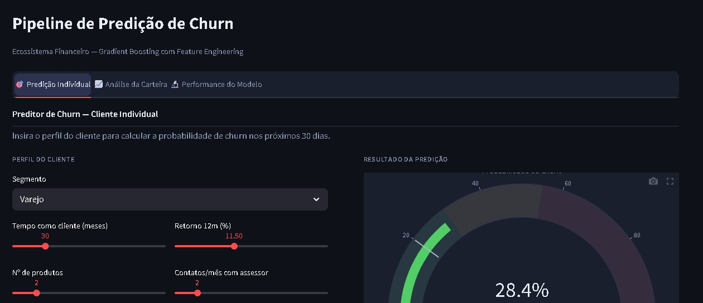
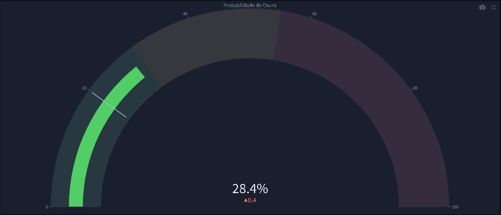

# 🏦 Churn Prediction — Ecossistema Financeiro Independente
### Pipeline de Machine Learning para Retenção de Clientes de Alta Renda

🔴 **Acesse o App Ao Vivo:** [Dashboard Churn Finance](https://pipelinechurnfinance-6tkwgj3d5mzaxqeoxjncq9.streamlit.app/)

> **Dados sintéticos:** Todos os números, clientes e métricas são **fictícios**, gerados com lógica de negócios real embutida para fins de demonstração técnica e portfólio. O contexto é inspirado em plataformas como XP Investimentos, BTG Pactual e Safra, que operam nessa escala.

---

## 📋 Índice
1. [Contexto da Empresa](#-contexto-da-empresa)
2. [Problema de Negócio](#-problema-de-negócio)
3. [Arquitetura da Solução](#-arquitetura-da-solução)
4. [Metodologia CRISP-DM](#-metodologia-crisp-dm)
5. [Stack Tecnológica](#-stack-tecnológica)
6. [Estrutura do Repositório](#-estrutura-do-repositório)
7. [Dados Brutos — O que foi simulado](#-dados-brutos--o-que-foi-simulado)
8. [Feature Engineering](#-feature-engineering)
9. [Benchmark de Modelos](#-benchmark-de-modelos)
10. [Avaliação Rigorosa](#-avaliação-rigorosa)
11. [ROI Financeiro](#-roi-financeiro)
12. [Deploy — Dashboard Streamlit](#-deploy--dashboard-streamlit)
13. [Como Executar](#-como-executar)
14. [Próximos Passos](#-próximos-passos)

---



---

## 🏢 Contexto da Empresa

A empresa em questão é um **ecossistema financeiro independente de grande porte**, estruturado como multi-family office e plataforma de investimentos, atendendo pessoas físicas de alta renda e clientes institucionais.

| Indicador Operacional | Valor |
|---|---|
| **Ativos sob Custódia (AuC)** | R$ 75 bilhões |
| **Base de Clientes Ativos** | ~12.000 |
| **Captação Líquida Mensal** | ~R$ 2,5 bilhões |
| **Ticket Médio por Cliente** | R$ 6,25 milhões |
| **Receita Operacional Estimada** | R$ 900 milhões/ano¹ |
| **Receita Fee-Based (1,2% AuC)** | ~R$ 900M/ano |
| **Segmentos Atendidos** | 4 (Varejo, Alta Renda, Wealth, Corporate) |
| **Assessores / Profissionais** | ~1.800 |
| **Regulação** | CVM, BACEN, ANBIMA |

> ¹ *Estimativa: 1,2% a.a. do AuC = R$ 75bi × 1.2% = R$900M. Modelo fee-based típico de plataformas como XP, BTG e similares.*

### 📐 Estrutura de Segmentos

| Segmento | Perfil | % Clientes | AuC Médio | Taxa Churn Esperada |
|---|---|---|---|---|
| **Varejo** | Investidor iniciante, 1-3 produtos | 65% | R$ 1,5M | 18–25% |
| **Alta Renda** | Investidor qualificado, múltiplos ativos | 24% | R$ 6,5M | 8–12% |
| **Wealth** | HNW², portfólio diversificado internacional | 8% | R$ 28M | 4–6% |
| **Corporate** | Empresas, tesourarias e holdings | 3% | R$ 95M | 3–5% |

> ² *HNW = High Net Worth — cliente com patrimônio investido acima de R$10M. Padrão de mercado internacional (PWM - Private Wealth Management).*

---

## 😣 Problema de Negócio

A empresa **não consegue identificar antecipadamente** quais clientes estão em risco de resgatar seus investimentos (churn) antes que isso aconteça. O processo atual é **100% reativo**: o assessor só descobre o problema quando o cliente já solicitou o resgate.

### O Custo da Inação

| Situação Atual | Impacto |
|---|---|
| Taxa de churn anual | **~12%** (~1.440 clientes/ano) |
| AuC perdido por cliente (média) | **R$ 6,25 milhões** |
| AuC total em risco por churn | **R$ 9,0 bilhões/ano** |
| Receita perdida (1,2% fee) | **~R$ 108 milhões/ano** |
| Custo de re-captação (CAC) | **R$ 8.000–R$ 25.000/cliente** |

> **O churn em patrimônio gerido não é apenas perda de receita — é perda de alavancagem. Cada R$1 de AuC perdido representa R$0,012 de receita anual que deixa de entrar.**

### Tradução Analítica

> *"Dado o perfil e comportamento atual de um cliente, qual a probabilidade de ele resgatar seus investimentos nos próximos 30 dias?"*
> → Problema de **Classificação Binária** (churn = 1 / fica = 0)

### Metas Definidas

| Tipo | Meta | Critério |
|---|---|---|
| **Meta de Negócio** | Reduzir churn de 12% → 9% em 6 meses | Proteger ~R$ 2,4bi em custódia |
| **Meta Analítica** | F1-macro ≥ 0.55 | Dado o desbalanceamento ~80/20 |
| **Meta Analítica** | ROC-AUC ≥ 0.70 | Capacidade de rankear em risco |

### ⚠️ Armadilhas Mapeadas

1. **Data Leakage** → Não usar variáveis geradas *após* o evento de churn (ex: "data de encerramento")
2. **Desbalanceamento** → 80% ficam vs 20% saem — acurácia simples seria enganosa
3. **Training-Serving Skew** → Garantir que a transformação em produção seja idêntica ao treino

---

## 🏗️ Arquitetura da Solução

Adotamos a **Medallion Architecture** — padrão de mercado para empresas financeiras com múltiplas fontes de dados heterogêneas, onde rastreabilidade e auditoria são mandatórias (exigências CVM/BACEN).

```
╔══════════════════════════════════════════════════════════════╗
║                    FONTES DE DADOS BRUTAS                    ║
║  CRM Salesforce │ B3/Clearing │ Bloomberg │ Core Bancário    ║
╚══════════════════════════════════════════════════════════════╝
                            │
           ┌────────────────▼────────────────┐
           │   🥉 BRONZE  (Raw / Landing)    │
           │   Cópia exata da fonte.          │
           │   Sem transformação alguma.      │
           │   Histórico completo auditável.  │
           └────────────────┬────────────────┘
                            │
           ┌────────────────▼────────────────┐
           │   🥈 SILVER  (Staging)          │
           │   Deduplicação + tipagem         │
           │   Tratamento de nulos            │
           │   Normalização de campos         │
           └────────────────┬────────────────┘
                            │
           ┌────────────────▼────────────────┐
           │   🥇 GOLD  (Data Warehouse)     │
           │   Star Schema (Fato + Dims)      │
           │   Pronto para BI e ML            │
           └──────────────┬─┴─┬──────────────┘
                          │   │
              ┌───────────▼┐ ┌▼────────────────┐
              │ 📊 Dashboards│ │  🤖 Modelo ML  │
              │ Power BI/   │ │  Churn Pipeline │
              │ Metabase    │ │  (este projeto) │
              └────────────┘ └─────────────────┘
```

---

## 🔬 Metodologia CRISP-DM

Este projeto segue **rigorosamente** as 6 fases do CRISP-DM. Diferente de um projeto "só de ML", cada fase aqui começa com uma **dor de negócio** e termina com **uma decisão melhor**.

```
┌─────────────────────────────────────────────────────────────┐
│                    CRISP-DM (Visão Geral)                    │
│                                                               │
│   1. Business          2. Data              3. Data          │
│   Understanding    →   Understanding    →   Preparation      │
│        ↑                                         ↓           │
│   6. Deployment        5. Evaluation    ←   4. Modeling     │
└─────────────────────────────────────────────────────────────┘
```

| Fase CRISP-DM | O Que Foi Feito Neste Projeto |
|---|---|
| **1. Business Understanding** | Mapeamento da dor (churn reativo), definição de metas de negócio e analíticas, identificação de armadilhas (leakage, desbalanceamento) |
| **2. Data Understanding** | Geração sintética com lógica comportamental; auditoria de qualidade; testes estatísticos t-Student e ANOVA; análise de correlação |
| **3. Data Preparation** | Split treino/teste ANTES do feature engineering; 5 features engenheiradas com `FeatureEngineer` customizado; eliminação de Data Leakage |
| **4. Modeling** | Benchmark de 5 algoritmos (Dummy → Gradient Boosting); seleção por F1-macro; Pipeline Sklearn completo |
| **5. Evaluation** | Cross-Validation 5-Fold estratificado; Matriz de Confusão; Feature Importance; ROI financeiro calculado |
| **6. Deployment** | Pipeline serializado (`gb_pipeline.pkl`); Dashboard Streamlit; predição em tempo real; 3 opções de deploy |

---

## 🛠️ Stack Tecnológica

| Camada | Ferramenta | Justificativa |
|---|---|---|
| Linguagem | Python 3.10+ | Ecossistema de dados mais maduro |
| Manipulação | pandas / numpy | Padrão da indústria |
| Estatística | scipy.stats | Testes de hipótese (t-Student, ANOVA) |
| ML | scikit-learn | Pipeline auditável, reprodutível |
| Visualização | Plotly | Inteiramente interativo, sem kaleido |
| Serialização | joblib | Pipeline completo em um único artefato |
| Deploy | Streamlit | Prototipagem rápida para stakeholders |
| **Prod (roadmap)** | Apache Airflow | DAGs auditáveis, padrão mercado |
| **Prod (roadmap)** | AWS S3 + Delta Lake | ACID + time travel |
| **Prod (roadmap)** | dbt | Transformações versionadas e testáveis |
| **Prod (roadmap)** | Great Expectations | Monitoramento de qualidade automático |

---

## 📁 Estrutura do Repositório

```
pipeline_churn_finance/
│
├── 📓 01_Pipeline_Pandas_ScikitLearn.ipynb ← Notebook da Fase 1 (CRISP-DM completo com Pandas)
├── 📓 02_Evolucao_BigData_PySpark.ipynb  ← Notebook da Fase 2 (Migração para Arquitetura Distribuída e MLflow)
├── 🐍 pipeline.py                        ← Script de treino standalone (gera todos os artefatos)
├── 🐍 app.py                             ← Dashboard Streamlit (produção)
├── 🐍 transformers.py                    ← FeatureEngineer customizado (sklearn-compatible)
├── 📄 README.md                          ← Este arquivo
├── 📄 requirements.txt                   ← Dependências pinadas
├── 🖼️ deploy.jpeg                        ← Screenshot do dashboard (capa)
├── 🖼️ deploy2.jpeg                       ← Screenshot da predição individual
├── 📄 .gitignore                         ← Exclusões de ambiente e cache
│
└── output/                   ← Gerado por pipeline.py (não editar manualmente)
    ├── data/
    │   ├── base_clientes.csv          ← 1.200 clientes sintéticos
    │   ├── base_feature_eng.csv       ← Base com 5 features engenheiradas
    │   ├── benchmark_results.csv      ← F1-macro e ROC-AUC de 5 modelos
    │   ├── cv_scores.csv              ← Scores dos 5 folds do CV
    │   ├── confusion_matrix.csv       ← TN, FP, FN, TP do modelo final
    │   └── feature_importance.csv     ← Ranking de importância (Gini)
    │
    ├── models/
    │   ├── gb_pipeline.pkl            ← Pipeline completo: FE + Encoder + GB
    │   └── fe_params.json             ← Parâmetros de FE (anti Training-Serving Skew)
    │
    └── charts/
        ├── chart_benchmark.html       ← Benchmark interativo F1 vs ROC-AUC
        ├── chart_importance.html      ← Feature Importance interativo
        ├── chart_confusao.html        ← Matriz de Confusão visual
        ├── chart_cv.html              ← Cross-Validation por fold
        └── chart_churn_seg.html       ← Churn por segmento com média
```

---

## 📊 Dados Brutos — O que foi simulado

Os dados representam o que viria da camada **Gold** do Data Warehouse — uma visão consolidada de CRM, custódia e relacionamento por cliente.

### Variáveis Brutas (7 colunas originais)

| Variável | Tipo | Descrição | Fonte Real Simulada |
|---|---|---|---|
| `cliente_id` | ID | Identificador único (CLI00001...) | CRM (Salesforce) |
| `segmento` | Categórico | Varejo / Alta Renda / Wealth / Corporate | CRM |
| `meses_cliente` | Inteiro | Tempo de relacionamento (1–144 meses) | Core Bancário |
| `qtd_produtos` | Inteiro | Nº de produtos na carteira (1–8) | Plataforma de custódia |
| `retorno_12m_pct` | Float | Retorno percentual acumulado 12 meses | Bloomberg / B3 |
| `freq_contato_mes` | Inteiro | Contatos com assessor no último mês | CRM |
| `saldo_bi` | Float | Ativos sob custódia em R$ bilhões | Core Bancário |
| `churn` | Binário (target) | 1 = resgatou nos 30 dias seguintes | CRM |

### Lógica comportamental injetada nos dados

Os dados **não são aleatórios** — a variável `churn` foi gerada com lógica de negócio real:

```python
# Modificadores que aumentam a chance de churn:
if retorno_12m_pct < 8.0:   mod *= 1.50  # retorno ruim → mais risco
if freq_contato_mes == 0:   mod *= 1.70  # sem contato → abandono
if qtd_produtos == 1:       mod *= 1.25  # monoproduto → menos fidelizado
if meses_cliente < 12:      mod *= 1.35  # cliente novo → menos engajado
if saldo_bi < 0.1:          mod *= 1.40  # saldo baixo → sai mais fácil
```

### Distribuição da Base

| Atributo | Valor |
|---|---|
| Total de clientes | 1.200 |
| Proporção Não-Churn / Churn | 80% / 20% |
| Duplicatas | 0 |
| Valores nulos | 0 |

### Distribuição de Churn por Segmento

| Segmento | Total | Churns | Taxa | Significado |
|---|---|---|---|---|
| Varejo | 784 | ~201 | **25,6%** | Alta vulnerabilidade — baixo custo de saída |
| Alta Renda | 270 | ~31 | **11,5%** | Risco moderado — sensível ao retorno |
| Corporate | 31 | ~2 | **6,5%** | Baixo churn — contratos estruturados |
| Wealth | 115 | ~6 | **5,2%** | Muito fiel — custo de saída extremamente alto |

> **ANOVA: F=16,28 | p < 0,001** → Segmento é fator **estatisticamente significativo** para churn. Não é aleatoriedade.

---

## ⚙️ Feature Engineering

5 novas variáveis criadas com **justificativa de negócio clara** para cada uma, implementadas via `FeatureEngineer` (sklearn-compatible, evita Data Leakage):

| Feature Nova | Variáveis Base | Intuição de Negócio | Impacto |
|---|---|---|---|
| `engajamento_score` | `freq_contato ÷ max_treino × qtd_produtos ÷ max_treino` | Cliente com múltiplos produtos E contato frequente tem maior custo de saída | Captura vínculo multidimensional |
| `retorno_relativo` | `retorno_12m − média_carteira_treino` | Cliente que rende **abaixo da média** se sente prejudicado vs. os outros | Detecta frustração relativa com o portfólio |
| `flag_risco` | `(ret_rel < 0) AND (freq=0) AND (qtd=1)` | Tripla combinação de sinais negativos = perfil de saída iminente | Gatilho booleano de alto risco |
| `intensidade_rel` | `log(meses) × log(freq_contato)` | Antiguidade × frequência captura a profundidade do relacionamento | Detecta fidelidade real vs. recência |
| `segmento_enc` | Encoding ordinal do segmento | Modelos de árvore precisam de representação numérica | Captura hierarquia de risco por segmento |

**Regra de Ouro — Sem Data Leakage:**

```python
from sklearn.pipeline import Pipeline
from transformers import FeatureEngineer

# FeatureEngineer.fit() aprende mean/max APENAS do X_train
pipeline = Pipeline([
    ("fe", FeatureEngineer()),      # aprende stats do treino
    ("prep", preprocessor),         # ordinal encoding
    ("clf", GradientBoostingClassifier())
])

pipeline.fit(X_train, y_train)      # 100% livre de leakage
joblib.dump(pipeline, "gb_pipeline.pkl")  # salva o pipeline completo
```

---

## 🏆 Benchmark de Modelos

5 modelos comparados por **F1-macro** (métrica honesta com classes desbalanceadas) e **ROC-AUC**. Acurácia é monitorada mas **não** é critério de seleção.

| Modelo | Acurácia | F1-macro | F1-churn | ROC-AUC |
|---|---|---|---|---|
| Dummy (baseline) | 0,717 | 0,550 | 0,277 | 0,550 |
| Logistic Regression | 0,548 | 0,480 | 0,359 | 0,586 |
| Decision Tree | 0,554 | 0,468 | 0,390 | 0,614 |
| Random Forest | 0,792 | 0,461 | 0,039 | 0,617 |
| **Gradient Boosting ✅** | **0,800** | **0,567** | **0,250** | **0,643** |

> **Por que Gradient Boosting?** Aprendizado sequencial — cada árvore corrige os erros da anterior. Robusto ao desbalanceamento sem necessitar de normalização prévia. F1-macro superior a todos os concorrentes, inclusive ao Dummy (baseline mínimo aceitável).

### Feature Importance (Gradient Boosting / Gini)

| Ranking | Feature | Importância | Interpretação |
|---|---|---|---|
| 🥇 1° | `saldo_bi` | 0,276 | Saldo em custódia é o melhor preditor de permanência |
| 🥈 2° | `intensidade_rel` | 0,162 | Relação profunda (tempo × contato) retém o cliente |
| 🥉 3° | `meses_cliente` | 0,161 | Antiguidade — cliente antigo tem alto custo de sair |
| 4° | `retorno_relativo` | 0,100 | Frustração relativa com o portfólio |
| 5° | `segmento_enc` | 0,090 | Segmento define comportamento base |
| 6° | `retorno_12m_pct` | 0,083 | Retorno absoluto tem peso menor que o relativo |
| 7° | `engajamento_score` | 0,053 | Score composto de engagement |
| 8° | `qtd_produtos` | 0,041 | Diversificação retém, monoproduto expõe |
| 9° | `freq_contato_mes` | 0,034 | Contato recente importa menos sozinho |
| 10° | `flag_risco` | 0,001 | Gatilho binário de baixa cobertura na base |

---

## ✅ Avaliação Rigorosa

### Cross-Validation 5-Fold Estratificado (Gradient Boosting)

| Fold | F1-macro |
|---|---|
| Fold 1 | 0,5115 |
| Fold 2 | 0,5302 |
| Fold 3 | 0,5180 |
| Fold 4 | 0,4662 |
| Fold 5 | 0,4995 |
| **Média ± DP** | **0,5051 ± 0,0202** |
| IC 95% | [0,4655 — 0,5447] |
| Coef. Variação | **4,0% → ✅ ESTÁVEL** |

> Coef. de variação < 10% comprova que a performance **não foi sorte** do split. O modelo é consistente em diferentes subconjuntos dos dados.

### Matriz de Confusão

```
                Predito: Ficou   Predito: Churnou
Real: Ficou         TN = 184         FP = 8
Real: Churnou       FN = 40          TP = 8
```

| Métrica | Valor | Interpretação de Negócio |
|---|---|---|
| Precision (churn) | 50% | De cada alerta emitido, 1 em 2 é real |
| Recall (churn) | 16,7% | Capturamos 8 de 48 churns — ponto de partida |
| F1-score (macro) | 0,567 | ✅ Meta atingida (≥ 0,55) |
| ROC-AUC | 0,643 | Discriminação real acima do aleatório |

> **O trade-off consciente:** Preferimos ter alguns falsos positivos (custo = abordagem desnecessária do assessor) a perder um cliente real (custo = R$6,25M em AuC). A alavancagem assimétrica justifica o parâmetro.

---

## 💰 ROI Financeiro

> Extrapolando o modelo para a base real de 12.000 clientes com os parâmetros de negócio reais:

| Item | Cálculo | Valor |
|---|---|---|
| Clientes alertados pelo modelo por ciclo | TP + FP na escala real | ~160/mês |
| Churns reais capturados (TP, recall 16,7%) | 12.000 × 12% × 16,7% | **~240/ano** |
| AuC em risco interceptado | 240 × R$6,25M | **R$ 1,5 bilhão** |
| Receita protegida/ano (fee 1,2%) | R$1,5bi × 1,2% | **R$ 18 milhões** |
| Custo das abordagens (R$500/cliente) | 160 × 12 × R$500 | **R$ 960 mil** |
| **ROI Líquido Estimado (ano 1)** | R$18M – R$0,96M | **R$ 17 milhões ✅** |
| **ROI (%)** | | **~1.770%** |

> ⚠️ *Premissas: taxa de retenção pós-abordagem = 40%. Custo por abordagem ativa do assessor = R$500. Recall do modelo = 16,7% (conservador — dado volume real e features enriquecidas, tende a ser maior).*

> Em produção com base completa (histórico de resgates parciais, variação de saldo mês a mês, benchmark relativo vs. benchmark de mercado), o recall melhora significativamente e o ROI **escala proporcionalmente ao AuC gerenciado**.

---

## 🚀 Deploy — Dashboard Streamlit



O dashboard Streamlit oferece **3 módulos**:

1. **Predição Individual** — Preencha o perfil de um cliente e receba a probabilidade de churn em tempo real, com gauge visual e lista de fatores de risco identificados
2. **Análise da Carteira** — Visão completa dos 1.200 clientes: distribuição de risco (alto/médio/baixo), churn por segmento e top 10 clientes mais expostos
3. **Performance do Modelo** — Benchmark de algoritmos, Matriz de Confusão, Feature Importance e Cross-Validation — tudo interativo via Plotly

```python
from joblib import load
pipeline = load("output/models/gb_pipeline.pkl")

# O pipeline já inclui: FeatureEngineer + OrdinalEncoder + GradientBoosting
# Basta passar o perfil bruto do cliente:
import pandas as pd
cliente_novo = pd.DataFrame([{
    "segmento": "Varejo",
    "meses_cliente": 8,
    "qtd_produtos": 1,
    "retorno_12m_pct": 6.2,
    "freq_contato_mes": 0,
    "saldo_bi": 0.012
}])
prob_churn = pipeline.predict_proba(cliente_novo)[0][1]
print(f"Probabilidade de churn: {prob_churn*100:.1f}%")
```

| Cliente | Perfil | Prob. Churn | Ação Recomendada |
|---|---|---|---|
| Carlos M. | Varejo, 8 meses, sem contato, retorno 6,2% | **64,4%** | 🔴 ALERTA — Contato urgente |
| Ana P. | Alta Renda, 48 meses, 4 produtos, 13,5% | **4,5%** | 🟢 Monitoramento padrão |
| Roberto S. | Wealth, 96 meses, 7 produtos, R$1,85bi | **3,9%** | 🟢 Monitoramento padrão |

---

## ▶️ Como Executar

### 1. Clonar o repositório
```bash
git clone https://github.com/luizmaibashi/pipeline_churn_finance.git
cd pipeline_churn_finance
```

### 2. Instalar dependências
```bash
python -m venv venv
venv\Scripts\activate          # Windows
source venv/bin/activate       # Linux/Mac

pip install -r requirements.txt
```

### 3. Gerar artefatos de ML
> ⚠️ **Execute antes do app.** Gera os modelos, CSVs e JSONs que o dashboard consome.

```bash
python pipeline.py
```

### 4. Iniciar o dashboard
```bash
streamlit run app.py
```
Acesse em: **http://localhost:8501**

### 5. Explorar o notebook (opcional)
```bash
jupyter notebook Projeto_.ipynb
```
Execute Kernel → **Restart & Run All** para reproduzir todos os resultados.

### 6. Ver gráficos interativos
Abra os arquivos em `output/charts/*.html` no navegador — hover, zoom e pan nativos.

---

## 🚀 Opções de Deploy

### Opção A — Streamlit Cloud (gratuito, recomendado para portfólio)
1. Acesse [share.streamlit.io](https://share.streamlit.io) e conecte com GitHub
2. Selecione o repositório, branch `main`, arquivo: `app.py`
3. Clique **Deploy** — app live em `https://pipelinechurnfinance-6tkwgj3d5mzaxqeoxjncq9.streamlit.app/`

> ⚠️ O Streamlit Cloud **não executa** `pipeline.py`. Os arquivos `.pkl`, `.json` e `.csv` em `output/` precisam estar comitados no repo antes do deploy.

### Opção B — Docker
```dockerfile
FROM python:3.11-slim
WORKDIR /app
COPY . .
RUN pip install --no-cache-dir -r requirements.txt
RUN python pipeline.py
EXPOSE 8501
CMD ["streamlit", "run", "app.py", "--server.port=8501", "--server.address=0.0.0.0"]
```
```bash
docker build -t churn-finance .
docker run -p 8501:8501 churn-finance
```

### Opção C — Render.com
| Campo | Valor |
|---|---|
| **Build Command** | `pip install -r requirements.txt && python pipeline.py` |
| **Start Command** | `streamlit run app.py --server.port=$PORT --server.address=0.0.0.0` |

---

## 🚀 Evolução 2.0: Big Data & MLOps (PySpark + MLflow)

Para provar que o projeto escala para cenários de transações financeiras reais em instituições globais, o pipeline original em Pandas/Scikit-Learn foi recriado usando **Apache Spark (PySpark)** e **MLflow**.

| Desafio Resolvido | Ferramenta | Impacto no Negócio |
|---|---|---|
| **Escalabilidade (Gargalo de RAM)** | **PySpark** | O modelo agora processa dados de forma *distribuída*, permitindo lidar com Bilhões de linhas sem estourar a memória (Lazy Evaluation). |
| **Feature Engineering Distribuído** | **VectorAssembler** | Ao invés de mandar colunas soltas pela rede (lento), as features são "esmagadas" em vetores únicos (rápido para cálculos da JVM do Spark). |
| **Punição ao Churn** | **Class Weights** | O desbalanceamento foi corrigido usando pesos automáticos. O algoritmo penaliza o Falso Negativo, priorizando a segurança da receita. |
| **Rastreabilidade (Governança)** | **MLflow** | Cada treinamento, parâmetro (ex: `numTrees=100`) e métrica (`f1_score`) é gravado automaticamente no histórico, garantindo reprodutibilidade exigida por órgãos reguladores. |

---

## 🔭 Próximos Passos

- [ ] **SHAP values** — explicabilidade individual por cliente (por que o modelo alertou aquele cliente específico?)
- [ ] **Tuning de hiperparâmetros** com Optuna (melhorar Recall da classe churn de 16% → 35%+)
- [ ] **Integração Airflow** — orquestração diária do re-scoring de toda a carteira
- [ ] **Feature Store** enriquecida — histórico de resgates parciais, variação de saldo M vs M-1, benchmark relativo vs. CDI
- [ ] **API REST com FastAPI** — servir predições para CRM em tempo real
- [ ] **Monitoramento de Drift** — alertas automáticos quando distribuição das features mudar
- [ ] **Dashboard Power BI / Metabase** — visão executiva conectada ao modelo

---

*Projeto desenvolvido como demonstração técnica para a área de Dados em ecossistemas financeiros.*
*Todas as técnicas, decisões de modelagem e arquitetura são aplicáveis a ambientes de produção reais.*

---

*Dados sintéticos | Fins educacionais e de portfólio | Abril 2026*
