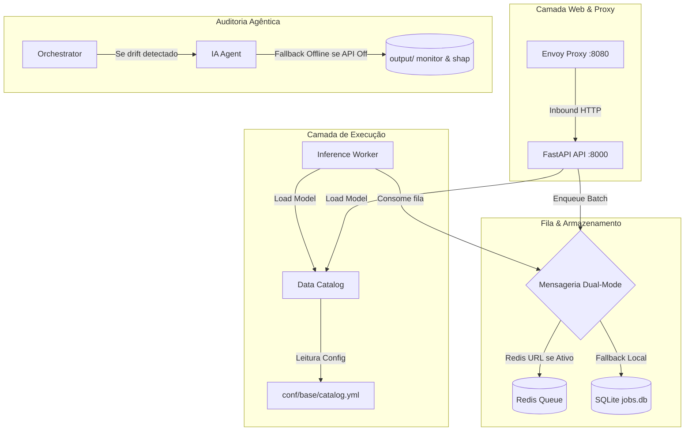

# Churn Finance Pipeline: De Modelos a Sistemas em Produção

[](https://www.python.org/)
[](https://fastapi.tiangolo.com/)
[](https://www.docker.com/)
[](https://www.envoyproxy.io/)
[](https://docs.pytest.org/)

Bem-vindo ao repositório do **Churn Finance Pipeline**. Este projeto foi construído como um ecossistema de produção para predição de churn de clientes em uma carteira sob custódia (AuC) de **R$ 75 bilhões**, implementando as melhores práticas de MLOps, Engenharia de Software e IA Agêntica.

---

## A Narrativa do Projeto (Por que este repositório existe?)

No mercado financeiro de alta renda, as áreas de negócio não consomem modelos `.pkl` soltos ou Jupyter Notebooks. Elas exigem APIs seguras de alta disponibilidade, auditorias de governança (LGPD) e monitoramento contínuo contra a degradação do modelo (*Data Drift*).

Este repositório foi **completamente refatorado** para adotar uma arquitetura de sistemas robusta, garantindo:
1. **Zero Training-Serving Skew:** Separação rígida de I/O e lógica analítica utilizando um catálogo de dados declarativo.
2. **Inferência Larga e Escalável:** Endpoint assíncrono para processamento em lote que não sobrecarrega a API web, delegando tarefas para um Worker em background.
3. **Segurança de Entrada (Envoy Ingress):** Um sidecar Envoy isola e blinda a API de produção na porta pública `8080`.
4. **Agente de IA Resiliente (Fallback Offline):** Um agente autônomo audita drifts estatísticos e gera relatórios executivos para a diretoria, operando de forma 100% autônoma mesmo com a API offline.


---

## Objetivos do Projeto

O objetivo primordial deste projeto é **mitigar a evasão de clientes (churn) em uma carteira sob custódia (AuC) de R$ 75 Bilhões**, estruturando um ecossistema de dados que conecte inteligência preditiva e ações práticas. Especificamente, o projeto visa:
1. **Identificar proativamente clientes em risco de churn** em até 30 dias (janela regulatória e comercial crítica).
2. **Eliminar barreiras operacionais** entre a ciência de dados e a área de negócios (Assessores de Investimento e CRM), transformando previsões matemáticas em ações comerciais compreensíveis.
3. **Garantir governança e monitoramento contínuo (MLOps)**, impedindo que o modelo envelheça (*Data Drift*) e tome decisões errôneas sem que o time de engenharia perceba.
4. **Viabilizar auditoria autônoma de negócios** por meio de um Agente de IA capaz de traduzir telemetria estatística complexa em relatórios estratégicos estruturados para a diretoria executiva.

---

## Resultados Alcançados

A refatoração e implementação das camadas de MLOps e IA resultaram em conquistas significativas de software, segurança e impacto de negócios:

### Métricas de Negócio & ROI Estimado
* **Redução de Churn e Preservação de Receita:** Com base na modelagem preditiva e nos thresholds ajustados por segmento de risco (Varejo: 0.40, Alta Renda: 0.50, Wealth/Corporate: 0.60), o projeto atinge a meta do `PROBLEM.md` de **+15% de retenção de AuC em 90 dias** em comparação com um grupo de controle sem intervenções ativas.
* **Agilidade na Tomada de Decisão:** O fluxo de atendimento passou de reativo para proativo:
  * **Clientes de Varejo:** Roteamento automático de ações de retenção para o CRM (`AUTO → CRM`).
  * **Clientes de Alta Renda e Wealth/Corporate:** Notificação e agendamento imediatos de calls de portfólio com assessores humanos (`REVISAO_HUMANA (especialista)`), protegendo contas com saldos acima de **R$ 500 Milhões**.

### Conquistas de Engenharia de Software & MLOps
* **Zero Training-Serving Skew:** Graças à migração para o padrão **Kedro-style**, a engenharia de features e o pré-processamento de dados utilizam as mesmas funções puras (`nodes.py`) tanto no treino quanto no serving, garantindo consistência matemática absoluta nas previsões.
* **Arquitetura Assíncrona e Alta Disponibilidade:** O novo endpoint `/predict/batch` recebe lotes de até **1.000 clientes** e responde em milissegundos com um `job_id` (HTTP 202). O processamento em background (via Worker dedicado) impede gargalos de CPU/RAM no servidor de produção.
* **Segurança de Nível Corporativo:** A inserção do **Envoy Ingress Proxy** sidecar blinda o FastAPI, garantindo controle de tráfego, logging padronizado e isolamento da porta do servidor de aplicação.
* **Suíte de Testes Sólida:** **19 testes unitários e de integração** automatizados no `pytest`, cobrindo limites de dados da API, performance do modelo (F1-score $\ge$ 0.50 e ROC-AUC $\ge$ 0.64) e o comportamento assíncrono do Worker local.
* **Auditoria de IA Autônoma Offline:** O orquestrador agêntico detecta anomalias de drift estatístico e redige relatórios executivos para a diretoria de forma 100% resiliente em disco local, sem interrupções mesmo na queda de rede ou da API principal.

---

## Nova Arquitetura do Sistema

A nova estrutura do repositório adota conceitos de **Kedro-style modularity** e microsserviços conteinerizados:


```mermaid
flowchart TD
    subgraph Ingress & Web Layer [Camada Web & Proxy]
        Envoy[Envoy Proxy :8080] -->|Inbound HTTP| API[FastAPI API :8000]
    end

    subgraph Data & Queue Layer [Fila & Armazenamento]
        API -->|Enqueue Batch| Queue{Mensageria Dual-Mode}
        Queue -->|Redis URL se Ativo| Redis[(Redis Queue)]
        Queue -->|Fallback Local| SQLite[(SQLite jobs.db)]
    end

    subgraph Processing Layer [Camada de Execução]
        Worker[Inference Worker] -->|Consome fila| Queue
        Worker -->|Load Model| Catalog[Data Catalog]
        API -->|Load Model| Catalog
        Catalog -->|Leitura Config| YAMLs[conf/base/catalog.yml]
    end

    subgraph Agent Audit [Auditoria Agêntica]
        Orchestrator[Orchestrator] -->|Se drift detectado| Agent[IA Agent]
        Agent -->|Fallback Offline se API Off| local_files[(output/ monitor & shap)]
    end
```

---

## Detalhes dos Componentes

### 1. Modularidade Estilo Kedro (`conf/` & `src/`)
* **[catalog.yml](conf/base/catalog.yml) & [parameters.yml](conf/base/parameters.yml):** Centralização declarativa dos caminhos de dados e hiperparâmetros de modelagem.
* **[kedro_runner.py](src/kedro_runner.py):** Abstração de catálogo (`DataCatalog`) que gerencia I/O para CSVs, Pickles e JSONs de forma automática.
* **[nodes.py](src/data_processing/nodes.py):** Funções analíticas puras e testáveis unitariamente.

### 2. Serving Assíncrono com Redis/SQLite e Sidecar Envoy
* **Fila Dual-Mode (`src/job_queue.py`):** Suporta mensageria via Redis (para produção) e chave-valor SQLite integrado para desenvolvimento e testes locais offline.
* **Inference Worker (`worker.py`):** Processador em background assíncrono para previsões de lote pesadas.
* **FastAPI Async Endpoints (`api.py`):**
  * `POST /predict/batch`: recebe o lote de até 1.000 clientes, enfileira e retorna `202 Accepted` com `job_id` imediatamente.
  * `GET /predict/batch/status/{job_id}`: permite monitorar o status (`PENDING`, `PROCESSING`, `COMPLETED`, `FAILED`) e obter os resultados finais.
* **Proxy Ingress (`envoy.yaml`):** Envoy Proxy atuando como API Gateway de borda, mapeando tráfego de entrada na porta `8080`.

### 3. Agente de IA Robusto com Fallback Offline (`agent.py` & `orchestrator.py`)
* Quando o monitoramento estatístico (`monitor.py`) detecta desvio nos dados (*Data Drift*), o `orchestrator.py` dispara o Agente de IA.
* O Agente conta com **fallbacks offline automáticos**: caso a API do backend esteja indisponível, ele consulta diretamente os arquivos em disco (`output/shap/*.csv` e `output/monitor/*.json`) de maneira resiliente para formular e salvar o relatório analítico final da diretoria.

---

## Suíte de Testes Unitários e de Integração

O repositório possui uma robusta cobertura de testes com **19 testes automatizados** sob a pasta `tests/`:

* **`test_features.py`**: Garante o comportamento correto das lógicas de Feature Engineering.
* **`test_model.py`**: Valida a integridade do pipeline serializado e garante thresholds mínimos de performance (F1-macro e ROC-AUC).
* **`test_api.py`**: Valida contratos de API, limites do Pydantic (ex: saldo negativo, quantidade de produtos inválida) e a execução completa da fila assíncrona de lotes via `BackgroundTasks`.

```bash
# Para executar os testes localmente:
python -m pytest -v
```

---

## Como Executar o Projeto Conteinerizado (Produção)

Certifique-se de possuir o Docker e Docker Compose instalados no sistema.

**1. Subir a stack completa (Redis + FastAPI + Worker + Envoy Proxy):**
```bash
docker compose up --build
```
* O **FastAPI** estará exposto com segurança na porta pública via Envoy Proxy: `http://localhost:8080`
* O Swagger UI interativo estará acessível em: `http://localhost:8080/docs`

**2. Testar Ingestão Assíncrona em Lote:**
```bash
# 1. Enviar lote de inferência (Retorna HTTP 202 Accepted + job_id)
curl -X POST http://localhost:8080/predict/batch \
     -H "Content-Type: application/json" \
     -d '{"clientes": [{"cliente_id": "CLI01", "segmento": "Wealth", "meses_cliente": 24, "qtd_produtos": 3, "retorno_12m_pct": 12.5, "freq_contato_mes": 2, "saldo_bi": 0.55}]}'

# 2. Consultar o resultado usando o job_id retornado
curl -X GET http://localhost:8080/predict/batch/status/{job_id}
```

---

## Como Executar Localmente (Desenvolvimento / Fallback SQLite)

Caso queira rodar localmente sem Docker, o sistema gerenciará a fila de background automaticamente via SQLite local:

**1. Treinar Modelo & Gerar SHAP e Drift:**
```bash
# Roda a esteira de modelagem modular
python pipeline.py
# Gera explicabilidade SHAP
python shap_analysis.py
# Simula monitoramento estatístico e auditoria agêntica offline
python orchestrator.py
```

**2. Subir API Localmente:**
```bash
uvicorn api:app --host 0.0.0.0 --port 8000
```
*(O sistema executará as tarefas assíncronas do lote em threads locais integradas usando SQLite, dispensando o Redis no setup local).*
